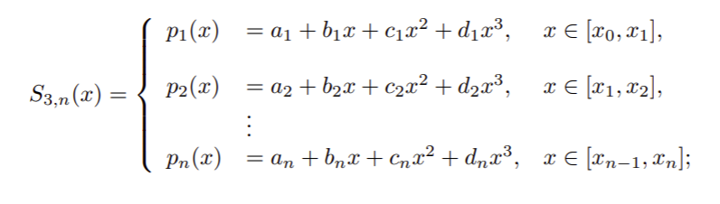
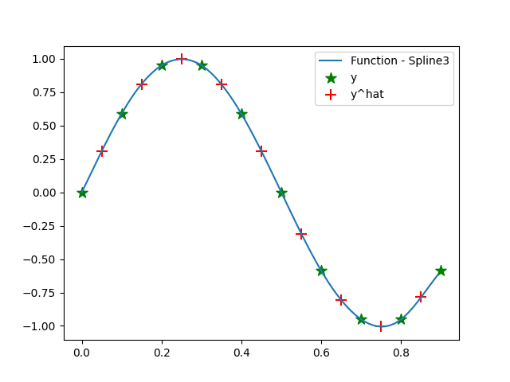
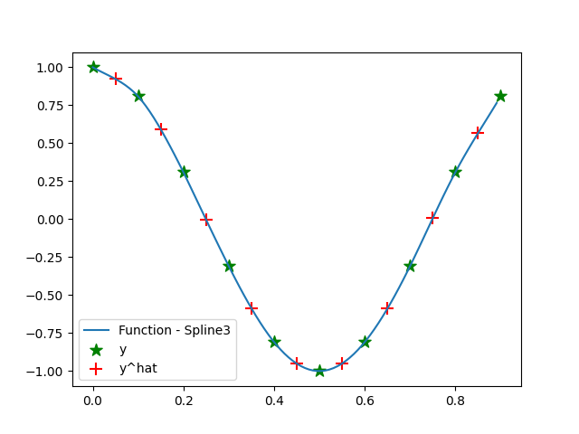
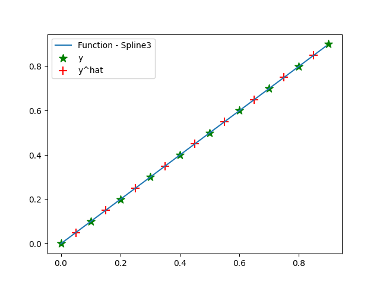

# Assignment1

# Info:

- Hany Hamed
- BS4-Robotics
- Fall 2021, Innopolis Univeristy
- Numerical Modeling course

# Sources:

- Formulation and implementation are based on:
    - [www.math.uh.edu/~jingqiu/math4364/spline.pdf](http://www.math.uh.edu/~jingqiu/math4364/spline.pdf) or [https://web.archive.org/web/20150702075205/https://www.math.uh.edu/~jingqiu/math4364/spline.pdf](https://web.archive.org/web/20150702075205/https://www.math.uh.edu/~jingqiu/math4364/spline.pdf)
    - [https://www.uio.no/studier/emner/matnat/math/MAT-INF4130/h17/book2017.pdf](https://www.uio.no/studier/emner/matnat/math/MAT-INF4130/h17/book2017.pdf)  chapter 1
    - [http://www.thevisualroom.com/tri_diagonal_matrix.html](http://www.thevisualroom.com/tri_diagonal_matrix.html)
- Lecture materials
- YouTube Explanation: [https://www.youtube.com/watch?v=LaolbjAzZvg](https://www.youtube.com/watch?v=LaolbjAzZvg)
- [https://towardsdatascience.com/numerical-interpolation-natural-cubic-spline-52c1157b98ac](https://towardsdatascience.com/numerical-interpolation-natural-cubic-spline-52c1157b98ac)
- [https://people.cs.clemson.edu/~dhouse/courses/405/notes/splines.pdf](https://people.cs.clemson.edu/~dhouse/courses/405/notes/splines.pdf)
- [https://timodenk.com/blog/cubic-spline-interpolation/](https://timodenk.com/blog/cubic-spline-interpolation/)
- [Hornbeck, H., 2020. Fast Cubic Spline Interpolation. arXiv preprint arXiv:2001.09253.](https://arxiv.org/pdf/2001.09253.pdf)

# Task:

Implement a function for Spline 3rd order (Cubic) interpolation

# Explanation:

## Cubic Spline Formulation:

The formulation for the Cubic Spline:

Interpolation using Cubic spline:

---

## Conditions:

### Smoothness conditions:

### Interpolation conditions:

### Boundary conditions:

Here, the coding implementation is based on the natural cubic spline, thus the following conditions hold:

But the rest of the formulation, for now, is using the complete cubic spline:

---

## Process:

Let us define (the 2nd derivative of the spline).

For each interior knot

$P_{i+1}(x_i)$ is a cubic polynomial on $[x_i, x_{i+1}]$, thus the 2nd derivative is linear $P^{''}_{i+1}(x_i) = z_i$ and $P^{''}_{i+1}(x_{i+1}) = z_{i+1}$ and we can get the following:

$h_{i+1}$ in the code is defined by delta_x

By integrating the above equation twice, such that C and D are the constants of the integration

(1)

By substitution of Interpolation conditions:

That follows:

Substitution in (1):

1st derivative:

After simplification

(2)

And for the same for i index

(3)

and according to the following continuity condition

We have the following:

This is the system of n-1 linear equations for n+1 unknowns, in order to get the rest of the sufficient linear equations, we apply the boundary conditions for the complete spline

i = 0 and substitute in (2) 

i = n and substitute in (3)

By combining the last three equations, we get a system of linear equations: $A\textbf{z} = \textbf{d}$

Such that 

A is a tridiagonal matrix

And the tridiagonal systems of equations can be solved by Tri-Diagonal Matrix Algorithm (TDMA) or Thomas Algorithm

## Code

In main.py

## Results

- Error for 1st set = 0.008192203025349065
    - [-0.0016426072569069583, 0.0027929221862741382, -0.002548429505472516, 0.0003396771690166167, -0.00019379194236129882, -0.00014746258937303747, 0.0008440768639047525, -0.0031963105198169472, 0.011944128620084316]
    - $\mu+-\sigma = 0.0009102447805943406+-0.004259654552161143$
- Error for 2nd set = -0.015768264450830224
    - [-0.009091463371454722, -0.0010719874520043193, -0.0018690863513000843, 0.0006948898753855737, -3.0853049121648546e-05, 0.00014710882624158206, -0.0004002448114652779, 0.0015179096192236919, -0.005664537736335018]
    - $\mu+-\sigma = -0.0017520293834255806+-0.0032442698651418225$
- Error for 3rd set = -2.7755575615628914e-16
    - [0.0, -5.551115123125783e-17, 0.0, 0.0, 0.0, 0.0, 0.0, -1.1102230246251565e-16, -1.1102230246251565e-16]
    - $\mu+-\sigma = -3.0839528461809905e-17+-4.6156379789502494e-17$
