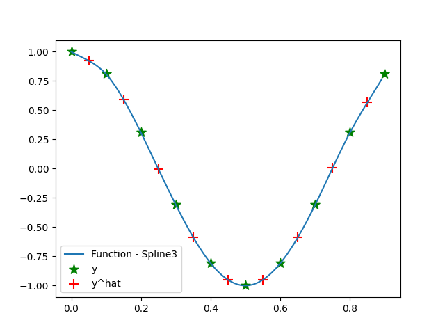

# NM_Fall21IU
This repository is used to work on my assignments and homeworks in Numerical modeling course at Innopolis University Fall 2021

## Assignment 1:

Create a cubic spline interpolation, more details in "[Assignment directory](https://github.com/hany606/NM_Fall21IU/tree/main/Assignments/assignment1)"

## Assignment 2:

Numerical integration using Composite Simpson 3/8 Rule

## Assignment 3:

Solving system of linear equations using Minimal residual method

## Assignment 4:

Solving system of non-linear equations using Newton's method
